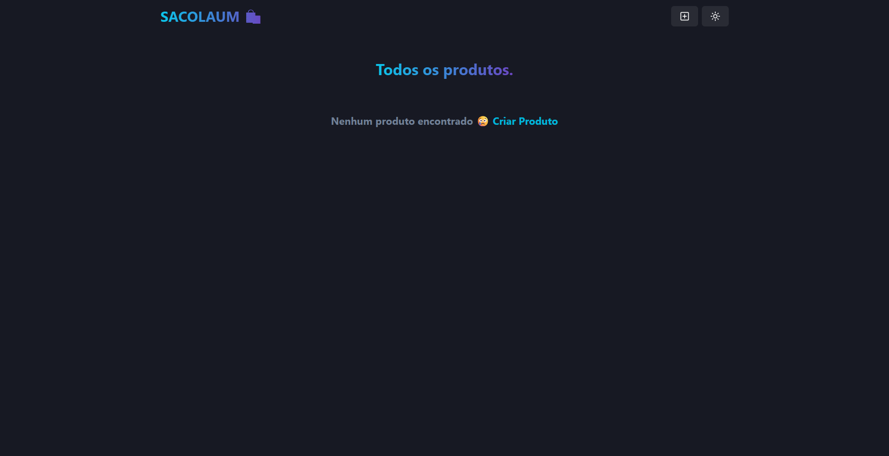

# Sacolaum

Uma aplicação full-stack para gerenciamento de produtos, construída com React no frontend e Node.js/Express no backend, utilizando MongoDB para armazenamento de dados.

## Funcionalidades

- ✅ Visualizar todos os produtos
- ✅ Criar novos produtos
- ✅ Atualizar produtos existentes
- ✅ Deletar produtos
- ✅ Interface responsiva com Chakra UI
- ✅ Animações suaves com Framer Motion
- ✅ Gerenciamento de estado com Zustand

## Tecnologias Utilizadas

### Frontend

- **React** - Biblioteca JavaScript para interfaces de usuário
- **Vite** - Ferramenta de build rápida
- **Chakra UI** - Biblioteca de componentes para React
- **Framer Motion** - Biblioteca de animações
- **React Router** - Roteamento para aplicações React
- **Zustand** - Gerenciamento de estado leve

### Backend

- **Node.js** - Ambiente de execução JavaScript
- **Express.js** - Framework web para Node.js
- **MongoDB** - Banco de dados NoSQL
- **Mongoose** - ODM para MongoDB

## Pré-requisitos

- Node.js (versão 16 ou superior)
- MongoDB (local ou MongoDB Atlas)
- npm ou yarn

## Instalação e Configuração

1. **Clone o repositório:**

   ```bash
   git clone <url-do-repositorio>
   cd sacolaum
   ```

2. **Instale as dependências:**

   ```bash
   npm run install-backend
   npm run install-frontend
   ```

3. **Configure as variáveis de ambiente:**
   Crie um arquivo `.env` na pasta `backend` com:

   ```
   MONGO_URI=your_mongodb_connection_string
   PORT=5000
   ```

4. **Execute a aplicação:**

   ```bash
   # Desenvolvimento
   cd frontend && npm run dev
   # Em outro terminal
   cd backend && npm run dev

   # Produção
   npm run build
   npm start
   ```

## Uso

1. Acesse `http://localhost:5173` (frontend)
2. Navegue pela lista de produtos
3. Clique em "Criar Produto" para adicionar novos itens
4. Use os botões de editar/deletar nos cards dos produtos

## API Endpoints

| Método | Endpoint            | Descrição               |
| ------ | ------------------- | ----------------------- |
| GET    | `/api/products`     | Obter todos os produtos |
| POST   | `/api/products`     | Criar novo produto      |
| PUT    | `/api/products/:id` | Atualizar produto       |
| DELETE | `/api/products/:id` | Deletar produto         |

## Estrutura do Projeto

```
sacolaum/
├── backend/
│   ├── config/
│   ├── controllers/
│   ├── models/
│   ├── routes/
│   └── server.js
├── frontend/
│   ├── public/
│   ├── src/
│   │   ├── components/
│   │   ├── pages/
│   │   ├── store/
│   │   └── App.jsx
│   └── package.json
└── package.json
```

## Captura de Tela



## Scripts Disponíveis

### Backend

- `npm run dev` - Inicia o servidor em modo desenvolvimento
- `npm start` - Inicia o servidor em modo produção

### Frontend

- `npm run dev` - Inicia o servidor de desenvolvimento
- `npm run build` - Constrói a aplicação para produção
- `npm run preview` - Visualiza a build de produção
- `npm run lint` - Executa o linter

### Root

- `npm run install-backend` - Instala dependências do backend
- `npm run install-frontend` - Instala dependências do frontend
- `npm run build-frontend` - Constrói o frontend
- `npm run build` - Instala dependências e constrói tudo
- `npm start` - Inicia em modo produção

## Contribuição

1. Fork o projeto
2. Crie uma branch para sua feature (`git checkout -b feature/nova-feature`)
3. Commit suas mudanças (`git commit -m 'feat: adiciona nova feature'`)
4. Push para a branch (`git push origin feature/nova-feature`)
5. Abra um Pull Request

## Licença

Este projeto está sob a licença ISC.
